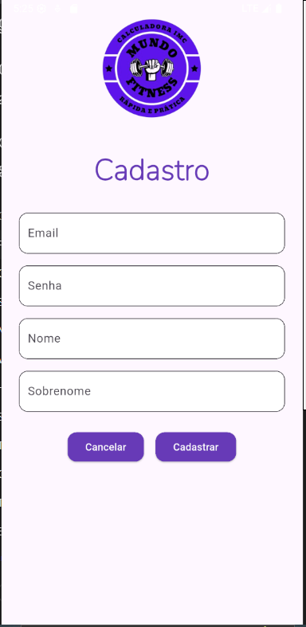
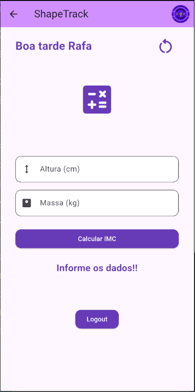

# 📱 Calculadora de IMC com Login e Cadastro

Este projeto é um aplicativo Flutter que calcula o IMC (Índice de Massa Corporal) do usuário, permitindo que ele registre e consulte seus dados de forma personalizada. O app inclui uma tela de login e cadastro com persistência local usando SQLite.

---

## 🧩 Funcionalidades

- ✅ Tela de Login com verificação de credenciais
- ✅ Tela de Cadastro com validação e armazenamento local
- ✅ Cálculo de IMC com exibição do resultado
- ✅ Armazenamento local de dados com SQLite
- ✅ Exibição de data, hora e saudação dinâmica na tela inicial
- ✅ Estrutura organizada com padrão MVC

---

## 📸 Capturas de Tela

| Login | Cadastro | Tela Inicial | Calculadora |
|-------|----------|--------------| ----------- |
|  |  |  |  |

> *Adicione suas imagens na pasta `assets/screenshots/` ou substitua os caminhos acima conforme necessário.*

---

## 🛠️ Tecnologias Utilizadas

- [Flutter](https://flutter.dev/)
- [Dart](https://dart.dev/)
- [SQLite (sqflite)](https://pub.dev/packages/sqflite)
- [intl](https://pub.dev/packages/intl)

---

## 🚀 Como Rodar o Projeto

### 1. Clone o repositório
```bash
git clone https://github.com/seu-usuario/nome-do-repo.git
cd nome-do-repo
